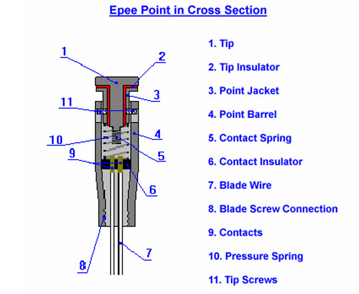
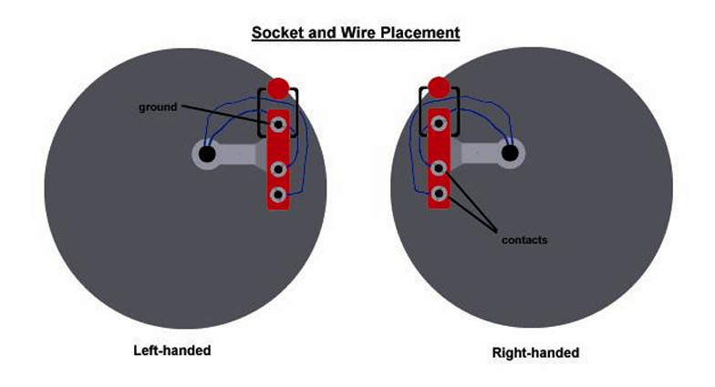
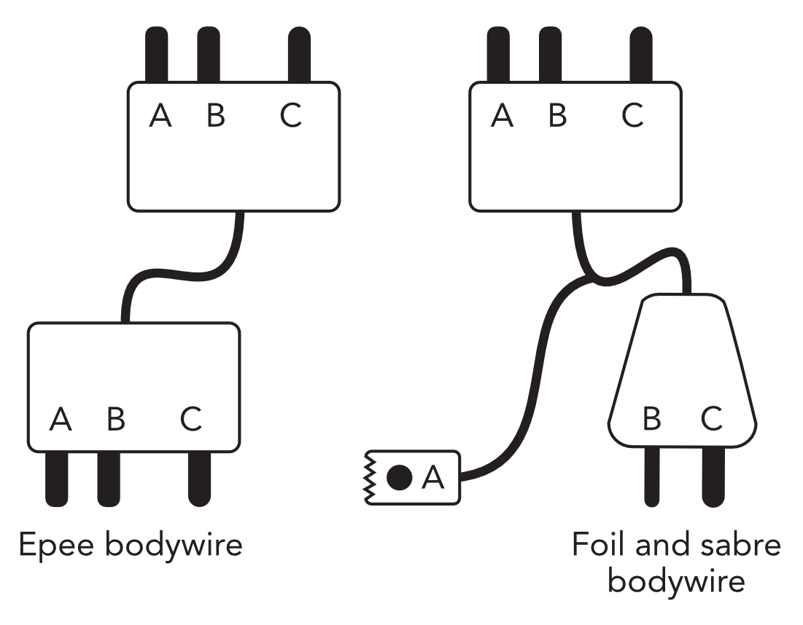

# Fencing Match Bracelet 

Fencing Match Bracelet is a device designed by and for fencers.
Fencing Score Devices can be pretty expensive, specially for developing countries.
We propose an alternative that can be built by any fencer who has a little bit of knockledge in electronics.

#Communication and microcontroler
We use a ESP32 3C Super Mini as the brain of the system, and for the communication protocol *ESP NOW*
ESP NOW offers a communication protocol for quick responses and low-power control.
On exteriors, it can reach up to 220 meters. 
For further information, visit: https://www.espressif.com/en/solutions/low-power-solutions/esp-now

# How does it work
## Epee
Epee tip consists of a few parts. 

When the tip is depressed, the spring connects with the contact and closes the circuit.

The ground is connected to the bridge, in this way, it doesn't detect the touch when the point is depressed against it.

With this information, we can conclude that

Epee is an open circuit, whenever the point is depressed, the circuit is closed and we can detect a signal. The signal must be superior of 2ms (FIE REGULATIONS)

## Foil and saber
We are currently focused on an initial model just for epee. Foil and saber are considered for the future.

# Materials Used
 - Esp32 3c Super Mini
 - White Leds
 - Blue Leds
 - Buzzer

# PCB
Considered for a future.

# 3D Model
Considered for a future.